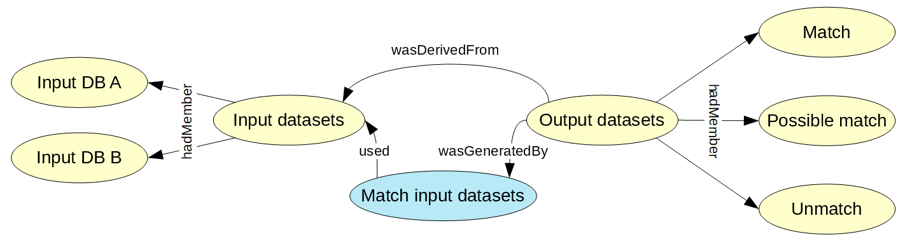
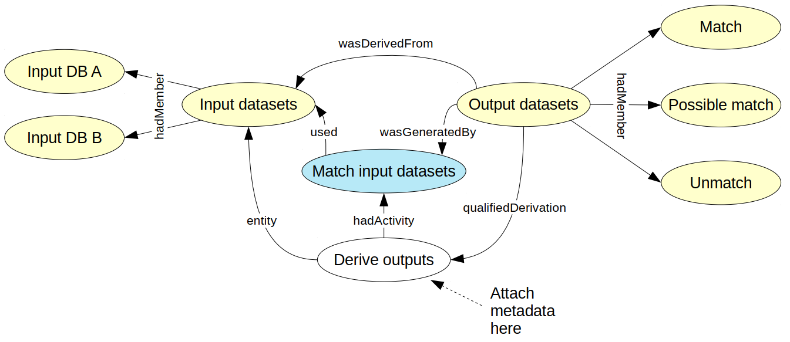

# Provenance use case on record linkage

## Use case

This document describes the use of the PROV and COOS ontologies in the description of a simple record linkage operation between two files.

The process model is based on the one found in Istat's [RELAIS user manual](https://www.istat.it/en/methods-and-tools/methods-and-it-tools/process/processing-tools/relais). In this example, two datasets A and B are matched and produce three datasets (match, possible matches, unmatch). There are prior and intermediate steps that are ignored for now.

The description of the linkage operation should include lineage metadata as specified by the following model provided by Statistics Canada.

(Insert more detail on the operation, in particular the content of lineage information to represent, a description of a specific match between two record, etc.).

## PROV model

In PROV-O terms, we can represent the inputs and outputs of the record linkage operation as instances of `prov:Collection`, composed of instances of `coos:StatisticalDataset`. In a simple PROV representation, a 'Match input datasets' activity used the input collection and generated the output collection. This output collection is linked to the input collection by a `prov:wasDerivedFrom` property. This simple model is represented in the following figure.

In the Statistics Canada model, the link between input and output data sets should be described at high-level with rich 'Data Set Lineage' metadata. For now, we only have a `prov:wasDerivedFrom` RDF predicate, which is clearly not fit for purpose since RDF predicates can not bear additional information. We thus have to use the [qualification mechanism](https://www.w3.org/TR/prov-o/#description-qualified-terms) described in the PROV-O specification. According to this mechanism, the `prov:wasDerivedFrom` property [can be qualified](https://www.w3.org/TR/prov-o/#wasDerivedFrom) as a `prov:qualifiedDerivation` property pointing from the output entity to a `prov:Derivation` instance.

It is recommended in PROV to define sub-classes of `prov:Derivation` for specific use cases. Here, referring to the Statistics Canada model, we can define the `coos:DataSetDerivation` class (the placement in the COOS namespace is provisional). An instance of this class ('Derive outputs') is then created, connecting the output dataset to the inputs and to the activity. More lineage metadata can also be attached to the 'Derive outputs' derivation. The corresponding model is given below.

We can enrich the model by adding information on the agents involved in the matching operation. We will keep the model simple and just suppose that the matching is made by Istat using the RELAIS software. The software will be represented as an instance of the `prov:SoftwareAgent` class, and Istat by an instance of the `coos:Organization`(which is a sub-class of `prov:Organization`). The matching activity is then connected to the RELAIS resource by a `prov:wasAssociatedWith` property.

It should be noted that the qualification mechanism can be applied to all the properties of the basic model, which allows to add information on how the inputs were used by the activity or how the outputs were generated. The fully-qualified model is given below.

